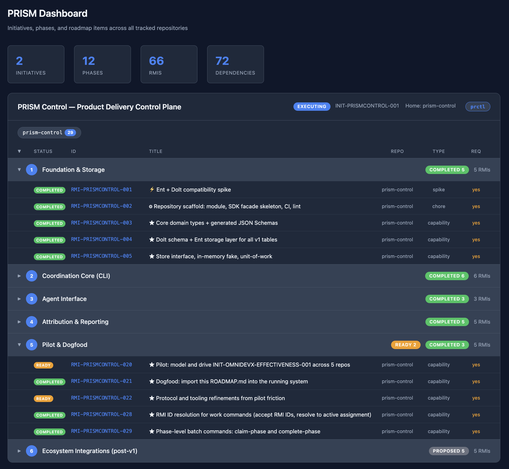

# PRISM Control

[![Go CI][go-ci-svg]][go-ci-url]
[![Go Lint][go-lint-svg]][go-lint-url]
[![Go SAST][go-sast-svg]][go-sast-url]
[![Docs][docs-godoc-svg]][docs-godoc-url]
[![Docs][docs-mkdoc-svg]][docs-mkdoc-url]
[![Visualization][viz-svg]][viz-url]
[![License][license-svg]][license-url]

 [go-ci-svg]: https://github.com/ProductBuildersHQ/prism/actions/workflows/go-ci.yaml/badge.svg?branch=main
 [go-ci-url]: https://github.com/ProductBuildersHQ/prism/actions/workflows/go-ci.yaml
 [go-lint-svg]: https://github.com/ProductBuildersHQ/prism/actions/workflows/go-lint.yaml/badge.svg?branch=main
 [go-lint-url]: https://github.com/ProductBuildersHQ/prism/actions/workflows/go-lint.yaml
 [go-sast-svg]: https://github.com/ProductBuildersHQ/prism/actions/workflows/go-sast-codeql.yaml/badge.svg?branch=main
 [go-sast-url]: https://github.com/ProductBuildersHQ/prism/actions/workflows/go-sast-codeql.yaml
 [docs-godoc-svg]: https://pkg.go.dev/badge/github.com/ProductBuildersHQ/prism
 [docs-godoc-url]: https://pkg.go.dev/github.com/ProductBuildersHQ/prism
 [docs-mkdoc-svg]: https://img.shields.io/badge/Go-dev%20guide-blue.svg
 [docs-mkdoc-url]: https://productbuildershq.com/prism
 [viz-svg]: https://img.shields.io/badge/Go-visualizaton-blue.svg
 [viz-url]: https://mango-dune-07a8b7110.1.azurestaticapps.net/?repo=ProductBuildersHQ%2Fprism
 [loc-svg]: https://tokei.rs/b1/github/ProductBuildersHQ/prism
 [repo-url]: https://github.com/ProductBuildersHQ/prism
 [license-svg]: https://img.shields.io/badge/license-MIT-blue.svg
 [license-url]: https://github.com/ProductBuildersHQ/prism/blob/main/LICENSE

Product Delivery Control Plane — the canonical, queryable store for cross-repository initiatives, per-repo Roadmap Items (RMIs), lease-based work assignments, and delivery evidence.

PRISM Control is headless and library-first. It coordinates work across repositories and agent sessions; it does not execute work, render UIs, or compute metrics. Those responsibilities belong to the execution layer (Claude Code sessions), the metrics layer (omnidevx, devfolio), and the visualization layer (VisionStudio).



## Quick Start

### Prerequisites

- Go 1.22+ with cgo enabled
- ICU library (for embedded Dolt's regex engine)

**macOS (Homebrew):**

```bash
brew install icu4c
```

### Build

```bash
export CGO_CPPFLAGS="-I$(brew --prefix icu4c)/include"
export CGO_LDFLAGS="-L$(brew --prefix icu4c)/lib"

go build -o prismctl ./cmd/prismctl/
```

### Initialize and Verify

```bash
prismctl db init
prismctl initiative list
prismctl validate
```

This creates `~/.productbuildershq/prism/`, initializes the embedded Dolt database, and runs schema migration.

## Connection Modes

PRISM Control supports two database modes:

| Mode | Access | Config | Use Case |
|------|--------|--------|----------|
| **Embedded** (default) | Single-session | No setup needed | Solo development, one `prismctl` at a time |
| **Server** | Multi-session | `prismctl db serve` | Multiple Claude Code sessions in parallel |

### Embedded Mode

The default. Data stored at `~/.productbuildershq/prism`. Exclusive filesystem lock — only one process at a time.

```bash
prismctl initiative list   # just works
```

To use a custom location:

```bash
PRISMCTL_DATA=/path/to/data prismctl initiative list
```

### Server Mode

Start a Dolt SQL server for concurrent access:

```bash
# Start the server in the background (auto-saves DSN to config)
prismctl db start --port 13306

# Check status
prismctl db status

# Terminal 2+: prismctl reads the DSN from config automatically
prismctl initiative list

# Restart or stop
prismctl db restart
prismctl db stop
```

For foreground operation (e.g., in a dedicated terminal), use `prismctl db serve --port 13306` instead.

Use `prismctl config show` to see the resolved DSN, or `prismctl config set dsn <value>` to set it manually.

## Session Protocol

Claude Code sessions are first-class users. Every session that implements work follows this four-step protocol:

### 1. Plan

```bash
prismctl work ready --repo github.com/org/myrepo
prismctl work ready --initiative INIT-X-001
```

The `--initiative` form automatically checks for ROADMAP.md drift against the database.

### 2. Claim

```bash
# Single RMI (worker auto-detected from CLAUDE_CODE_SESSION_ID)
prismctl work claim RMI-MYREPO-042 --lease-hours 4

# Entire phase
prismctl work claim-phase INIT-X-001/phase-2 --lease-hours 4

# Auto-transition proposed/planned RMIs to ready first
prismctl work claim-phase INIT-X-001/phase-2 --ready --lease-hours 4
```

### 3. Execute

Every commit carries the `Refs:` trailer:

```bash
git commit -m "feat(widget): add overlay support

Refs: RMI-MYREPO-042"
```

### 4. Update

```bash
# Mark complete and transition RMI
prismctl work complete RMI-MYREPO-042 --transition

# Complete multiple RMIs
prismctl work complete RMI-MYREPO-042 RMI-MYREPO-043 --transition

# Complete an entire phase
prismctl work complete-phase INIT-X-001/phase-2 --transition

# Or release if handing off to another session
prismctl work release RMI-MYREPO-042 \
  --handoff '{"completed":["core logic"],"remaining":["tests"],"next_action":"add unit tests"}'
```

## Dashboard

Two-level web dashboard with auto-refresh:

```bash
# Live server (default, re-queries DB every 5s)
prismctl dashboard

# Custom port
prismctl dashboard --port 8080

# Static HTML file (one-shot snapshot)
prismctl dashboard --static
```

The landing page shows initiative cards grouped by program, progress bars, and RMI status distribution. Click an initiative or program to drill down into phase/RMI detail.

## Programs and Initiative Dependencies

Programs are first-class entities that group related initiatives:

```bash
# Create a program
prismctl program create --id PROG-PLATFORM --name "Platform Modernization" --org default

# Assign initiatives to a program
prismctl initiative create --id INIT-X-001 --title "..." --program PROG-PLATFORM
prismctl initiative update INIT-X-001 --program PROG-PLATFORM

# List and inspect programs
prismctl program list
prismctl program get PROG-PLATFORM
```

Define ordering between initiatives:

```bash
prismctl initiative dep add --source INIT-X-001 --target INIT-Y-001 --relationship requires
prismctl initiative dep list
prismctl initiative dep list INIT-X-001
```

The dashboard groups initiatives by program and shows initiative dependency edges.

## CLI Reference

```
prismctl db init                        Initialize database and run migration
prismctl db serve                       Start a Dolt SQL server (foreground)
prismctl db start|stop|restart          Background server lifecycle management
prismctl db status                      Check server status (PID, port, DSN)
prismctl db create-views                Create read-only SQL views for consumers

prismctl dashboard                      Two-level web dashboard (summary + drill-down)

prismctl registry add|list|scan         Repository catalog
prismctl registry deps|unpushed         Dependency analysis and dirty-repo detection

prismctl program create|list|get|update  Program management
prismctl program migrate-strings        Convert free-text programs to entities

prismctl initiative create|list|get     Initiative lifecycle management
prismctl initiative update|transition
prismctl initiative dep add|list        Initiative dependency edges

prismctl phase add|list                 Themed phase groupings

prismctl rmi create|update|get|list     Roadmap items
prismctl rmi dep add|list               RMI dependency edges
prismctl rmi update-phase               Bulk status transitions

prismctl work ready                     Ready, unblocked, unclaimed work
prismctl work claim|claim-phase         Lease-based work assignment
prismctl work release|renew             Release or extend a lease
prismctl work update|complete           Evidence and status updates
prismctl work complete-phase            Complete all in-progress RMIs in a phase
prismctl work status                    List all active assignments

prismctl roadmap import|generate|diff   Sync ROADMAP.md with the database

prismctl ingest git <repo-id>           Scan commits for Refs: trailers
prismctl ingest changelog <repo-id>     Import structured-changelog entries

prismctl report initiative <id>         End-to-end initiative report (JSON/Markdown)
prismctl release plan <initiative-id>   Dependency-ordered release plan
prismctl validate                       Consistency checks across the store
prismctl export                         JSONL snapshots of all tables

prismctl mcp                            MCP server (stdio transport)
```

## MCP Server

Register in your project's `.mcp.json` for agent sessions:

```json
{
  "mcpServers": {
    "prism-control": {
      "command": "prismctl",
      "args": ["mcp"],
      "env": {}
    }
  }
}
```

Tools: `program_list`, `program_create`, `initiative_list`, `initiative_get`, `initiative_create`, `rmi_create`, `work_ready`, `task_claim`, `task_release`, `task_update`, `report_initiative`.

## Product Repo Setup

Repos participating in PRISM-tracked initiatives add a pointer to their `CLAUDE.md`:

```markdown
## PRISM Control

This repo's roadmap items are tracked in [prism-control](https://github.com/ProductBuildersHQ/prism-control).
Use `prismctl work ready --repo github.com/org/<this-repo>` to find claimable work,
and carry the `Refs: RMI-<REPOSLUG>-<NNN>` trailer on every commit.
```

## Architecture

```
prism-control/
├── cmd/prismctl/          CLI (thin Cobra adapter)
├── pkg/
│   ├── store/             Store interface + in-memory fake
│   │   └── doltstore/     Ent-backed Dolt implementation (server + embedded)
│   ├── service/           Shared service layer (CLI and MCP call this)
│   ├── initiative/        Initiative lifecycle + phase status derivation
│   ├── assignment/        Lease-based work claims
│   ├── evidence/          Trailer parsing + attribution
│   ├── ingest/            Git commit + changelog ingestion
│   ├── report/            Initiative report generation
│   ├── validate/          Consistency checks
│   ├── mcpserver/         MCP server (11 tools, stdio transport)
│   ├── export/            JSONL snapshots
│   ├── release/           Dependency-ordered release plans
│   ├── reposcan/          Git repo scanning (via gogit)
│   └── roadmap/           ROADMAP.md parsing and generation
├── ent/                   Ent codegen (MySQL dialect → Dolt)
├── docs/
│   ├── specs/             PRD, TRD, PLAN, ROADMAP, WALKTHROUGH
│   ├── integrations/      VisionStudio, omnidevx, devfolio
│   └── sql/               Read-only SQL views
└── schema/                Generated JSON Schemas (//go:embed)
```

**Library-first:** all behavior lives in `pkg/*`. The CLI and MCP server are thin adapters over one shared service layer — both call identical service methods.

**Store interface:** domain logic depends only on `pkg/store.Store` (an interface). The in-memory fake enables unit testing without Dolt; `doltstore` provides the production implementation with both embedded and server modes.

## Data Backup

Dolt databases can be backed up to a Git remote:

```bash
cd ~/.productbuildershq/prism/prismcontrol
dolt remote add backup git@github.com:org/prism-backup.git
dolt push backup main
```

## Specs

Design decisions live in `docs/specs/`:

- [PRD](docs/specs/PRD.md) — Problem, goals, non-goals, success metrics
- [TRD](docs/specs/TRD.md) — Schema, package layout, CLI/MCP surfaces, testing strategy
- [PLAN](docs/specs/PLAN.md) — Phased build order with exit criteria
- [ROADMAP](docs/specs/ROADMAP.md) — RMI-level breakdown by themed phase
- [WALKTHROUGH](docs/specs/WALKTHROUGH.md) — End-to-end agent session example

## Stack

- [Dolt](https://github.com/dolthub/dolt) — MySQL-compatible database with git-like version control
- [Ent](https://entgo.io/ent) — Go ORM (MySQL dialect)
- [Cobra](https://github.com/spf13/cobra) — CLI framework
- [Go MCP SDK](https://github.com/modelcontextprotocol/go-sdk) — MCP server
- [gogit](https://github.com/grokify/gogit) — Git log parsing for commit ingestion

## License

TBD
